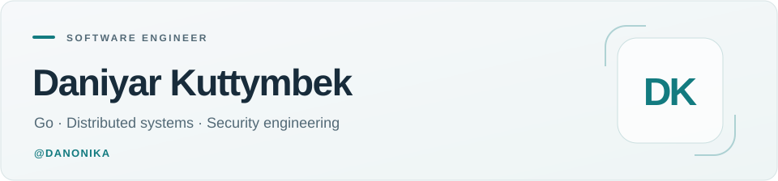

<picture>
  <source media="(prefers-color-scheme: dark)" srcset="assets/header-dark.svg">
  
</picture>

[LinkedIn](https://linkedin.com/in/danonika) · [Google Scholar](https://scholar.google.com/citations?user=Dwtw4AUAAAAJ) · [Research](https://doi.org/10.3390/app15179691)

I'm a **software engineer with 5+ years of experience** building backend platforms, distributed systems, and infrastructure automation in **Go**. My work spans high-concurrency services, real-time data pipelines, and security engineering.

## Selected work

### Building Agent Kit

A complete plugin for AI-assisted development, built around a **Go MCP server**, **34 workflow skills**, and a **local control plane**. Connects research, planning, implementation, and verification in one development workflow.

- **Workflow orchestration:** staged build plans, specialized research and coding skills, session hooks, and handoffs between agents.
- **Document and data tools:** PDF and spreadsheet processing, document search, telemetry analysis, charts, and generated reports.
- **Session management:** a CLI, background daemon, terminal dashboard, SQLite session storage, and isolated Git worktrees.
- **Routing and memory:** experimental capability routing using keywords, embeddings, and learned feedback, plus durable project learnings.
- **Quality and evaluation:** build and test gates, security review, evaluation aggregation and calibration, and frozen demo bundles.
- **Packaging and integrations:** adapters for Codex, Claude Code, OpenCode, and Cursor; cross-platform setup and repair; optional PostgreSQL and MinIO storage.

**Go · MCP · SQLite · PostgreSQL · MinIO · Docker**

*Source repository is currently private.*

### [IoT security research](https://doi.org/10.3390/app15179691)

Co-author of **A Survey of Cross-Layer Security for Resource-Constrained IoT Devices**, published in *Applied Sciences*, 15(17), 9691 (2025).

## Core toolkit

| Area | Technologies |
| :--- | :--- |
| Languages | **Go**, C/C++, Python, SQL, Rust |
| Backend & messaging | REST, gRPC, WebSocket, OpenAPI, Kafka, RabbitMQ, MQTT |
| Data | PostgreSQL, Redis, MySQL, MongoDB, ClickHouse, Elasticsearch |
| Infrastructure | Linux, Docker, Kubernetes, AWS, CI/CD |
| Observability | Prometheus, Grafana, ELK, Jaeger |

I care about concurrency, API design, profiling, and making systems easier to test and operate.

## GitHub stats

<picture>
  <source media="(prefers-color-scheme: dark)" srcset="https://github-stats-extended.vercel.app/api?username=Danonika&amp;card_width=480&amp;border_radius=12&amp;disable_animations=true&amp;hide=stars%2Ccommits%2Ccontribs&amp;show=prs_merged%2Call_time_contribs&amp;hide_rank=true&amp;show_icons=true&amp;custom_title=Open-source+collaboration&amp;text_bold=false&amp;number_format=long&amp;line_height=28&amp;bg_color=141e29&amp;title_color=6ad2cc&amp;text_color=ecf4f8&amp;icon_color=6ad2cc&amp;border_color=2a424a">
  
</picture>

<picture>
  <source media="(prefers-color-scheme: dark)" srcset="https://github-stats-extended.vercel.app/api/top-langs/?username=Danonika&amp;card_width=480&amp;border_radius=12&amp;disable_animations=true&amp;layout=compact&amp;langs_count=6&amp;size_weight=0&amp;count_weight=1&amp;custom_title=Languages+by+repository&amp;bg_color=141e29&amp;title_color=6ad2cc&amp;text_color=ecf4f8&amp;icon_color=6ad2cc&amp;border_color=2a424a">
  
</picture>

All-time public collaboration. Languages are weighted by repository count; private code is not included.

[View the 2025 calendar artwork](https://github.com/Danonika?tab=overview&from=2025-01-01&to=2025-12-31) · [How it was made](calendar-art/README.md)

## Background

Bachelor's degree in **Information Security Technologies**, Eurasian National University. Competitive programming background with awards at the **ICPC Northern Eurasian Finals** and national and international informatics olympiads.

---

[Explore my repositories →](https://github.com/Danonika?tab=repositories)
