<picture>
  <source media="(max-width: 600px) and (prefers-color-scheme: dark)" srcset="assets/header-mobile-dark.svg">
  <source media="(max-width: 600px)" srcset="assets/header-mobile-light.svg">
  <source media="(prefers-color-scheme: dark)" srcset="assets/header-dark.svg">
  
</picture>

I'm **Daniyar**, a **Software & Security Engineer** with **5+ years of experience** in Go backends, distributed systems, and security automation. I build reliable services, practical security tools, and AI agent workflows that make complex work easier to inspect and verify.

## What I'm building

### Hackathon Agent Kit

**One brief → deep research → working software → verified results.**

An agent toolkit designed to take a problem from its initial brief through research, implementation, and evaluation in one connected workflow. It also investigates existing projects: mapping architecture, tracing data flow, examining dependencies, and identifying risks before making changes.

- **Research deeply:** investigate the domain, compare approaches, analyze documents and data, and ground decisions in sources.
- **Build end to end:** turn the brief into a staged plan, coordinate coding workflows, and carry context between sessions.
- **Verify and improve:** combine test gates, security checks, independent evaluation, and bounded improvement rounds.
- **Stay in control:** local session history, reusable learnings, isolated Git worktrees, and reviewable evidence.

**Go MCP runtime · 34 workflow skills · SQLite control plane** 
Integrations: **Codex · Claude Code · OpenCode · Cursor**

Actively developed. Source is currently private.

## Security engineering & research

My security work spans assessment automation, identity and authentication systems, network tooling, and security-aware infrastructure. I bring the same focus on reliability, observability, and verification to backend engineering.

Co-author of [**A Survey of Cross-Layer Security for Resource-Constrained IoT Devices**](https://doi.org/10.3390/app15179691), published in *Applied Sciences* (2025).

## My toolbox

**Backend:** REST, gRPC, WebSocket, MQTT · **Observability:** Grafana, ELK, Jaeger 
**Focus:** concurrency, API design, profiling, testing, and distributed system design.

## GitHub stats

<!-- STATS:START -->
<picture>
  <source media="(prefers-color-scheme: dark)" srcset="assets/stats/activity-dark.svg">
  
</picture>
<picture>
  <source media="(prefers-color-scheme: dark)" srcset="assets/stats/languages-dark.svg">
  
</picture>

Public + accessible private activity. Language shares are weighted by repository count. Updated daily via GitHub Actions. [Calendar artwork](calendar-art/README.md) is included in contribution totals.
<!-- STATS:END -->

<b>Education & competitive programming</b>

- **BSc, Information Security Technologies** — Eurasian National University.
- **ICPC Northern Eurasian Finals:** honorable mention and third-degree awards.
- Medalist in national and international informatics olympiads.

---

[Let's build something useful.](https://linkedin.com/in/danonika) · [Explore repositories](https://github.com/Danonika?tab=repositories) · [2025 calendar art](https://github.com/Danonika?tab=overview&from=2025-01-01&to=2025-12-31)
