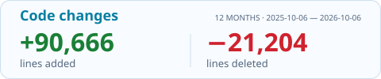

Rendered with <a href="readme-motion/cars-header/README.md">README Motion</a> · Original edit by <a href="https://www.tiktok.com/@hudsonfilms__/video/7523135205314514183">@hudsonfilms__</a>

I'm **Daniyar**, a **Software Engineer** with **5+ years of experience** in Go backends, distributed systems, and security automation. I build reliable services, practical security tools, and AI agent workflows that make complex work easier to inspect and verify.

## What I'm building

### Hackathon Agent Kit

**One brief → deep research → working software → verified results.**

An agent toolkit designed to take a problem from its initial brief through research, implementation, and evaluation in one connected workflow. It also investigates existing projects: mapping architecture, tracing data flow, examining dependencies, and identifying risks before making changes.

- **Research deeply:** investigate the domain, compare approaches, analyze documents and data, and ground decisions in sources.
- **Build end to end:** turn the brief into a staged plan, coordinate coding workflows, and carry context between sessions.
- **Verify and improve:** combine test gates, security checks, independent evaluation, and bounded improvement rounds.
- **Stay in control:** local session history, reusable learnings, isolated Git worktrees, and reviewable evidence.

**Go MCP runtime · 34 workflow skills · SQLite control plane** 
Integrations: **Codex · Claude Code · OpenCode · Cursor**

Actively developed. Source is currently private.

### README Motion

**Markdown → animated GitHub README.**

A reusable CLI that renders ordinary Markdown over animated backgrounds, with native animated SVGs, light/dark themes, custom GIFs, and a readable text fallback. The generated images display directly in GitHub READMEs.

[**View the animated README on GitHub →**](readme-motion/README.md) · [View its Markdown source](readme-motion/README.source.md) · [GIF → SVG comparison](readme-motion/comparison/README.md)

## Security engineering & research

My security work spans assessment automation, identity and authentication systems, network tooling, and security-aware infrastructure. I bring the same focus on reliability, observability, and verification to backend engineering.

Co-author of [**A Survey of Cross-Layer Security for Resource-Constrained IoT Devices**](https://doi.org/10.3390/app15179691), published in *Applied Sciences* (2025).

## My toolbox

<strong>Programming languages</strong> 

<strong>Cloud &amp; infrastructure</strong> 

<strong>Databases, caching &amp; messaging</strong> 

<strong>Frameworks &amp; tools</strong> 

<strong>Observability</strong> 

<strong>Methodologies &amp; engineering</strong> 

<strong>Testing</strong> 

<strong>AI engineering</strong> 

## GitHub stats

<!-- STATS:START -->
<picture>
  <source media="(prefers-color-scheme: dark)" srcset="assets/stats/activity-dark.svg">
  
</picture>
<picture>
  <source media="(prefers-color-scheme: dark)" srcset="assets/stats/code-changes-compact-dark.svg">
  
</picture>

Public + accessible private activity. Code changes cover authored, non-merge commits on default branches over the past 12 months. Updated daily. [How these stats are counted](assets/stats/README.md). [Calendar artwork](calendar-art/README.md) is included in contribution totals.
<!-- STATS:END -->

<b>Education & competitive programming</b>

- **BSc, Information Security Technologies** — Eurasian National University.
- **ICPC Northern Eurasian Finals:** honorable mention and third-degree awards.
- Medalist in national and international informatics olympiads.

---

[Let's build something useful.](https://linkedin.com/in/danonika) · [Explore repositories](https://github.com/Danonika?tab=repositories) · [2025 calendar art](https://github.com/Danonika?tab=overview&from=2025-01-01&to=2025-12-31)
