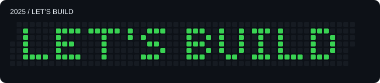

# 2025 contribution-calendar artwork

**LET’S BUILD** — 94 lit days, one intentionally backdated commit per pixel.

Created on 2026-10-05 as decorative profile artwork. These commits represent pixels, not software development performed in 2025.

The lettering uses the pixel font and date planner from [GitArt](https://github.com/AxZyzz/GitArt), with tighter letter spacing and an apostrophe. The design fits within 48 columns. The profile’s pre-artwork history is preserved.

The exact dates are recorded in `2025-pixels.jsonl`. GitArt is MIT-licensed; see [LICENSE-GitArt.txt](LICENSE-GitArt.txt).
