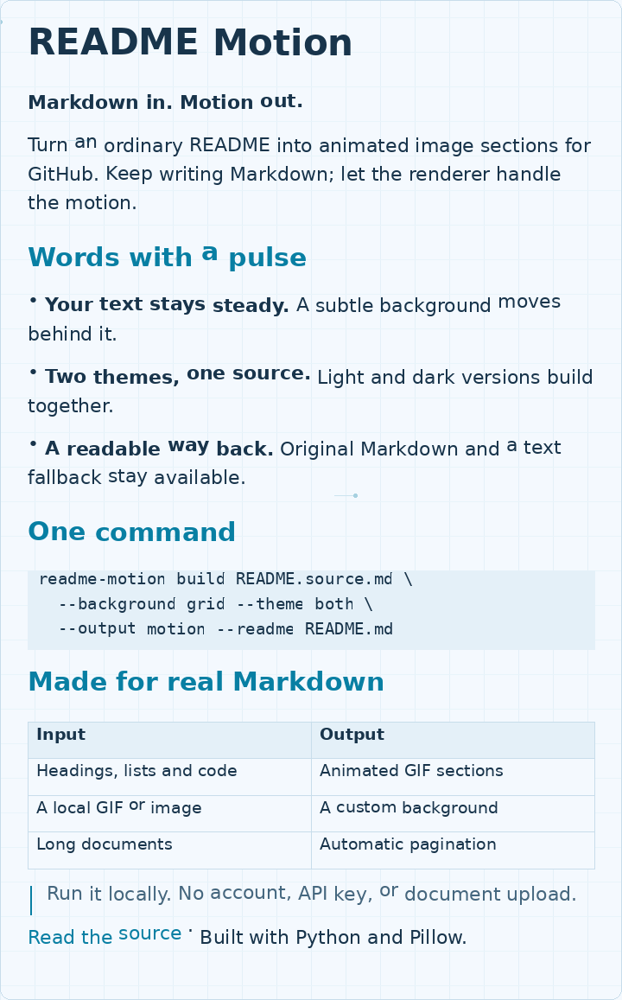

<!-- Generated by README Motion; edit the original Markdown, then rebuild. -->

<picture>
  <source media="(prefers-color-scheme: dark) and (prefers-reduced-motion: reduce)" srcset="rendered/assets/readme-motion-2e148d1ab3b4-01-dark.png">
  <source media="(prefers-color-scheme: dark)" srcset="rendered/assets/readme-motion-2e148d1ab3b4-01-dark.gif">
  <source media="(prefers-reduced-motion: reduce)" srcset="rendered/assets/readme-motion-2e148d1ab3b4-01-light.png">
  
</picture>

[Read the original Markdown with clickable links](README.source.md)

Readable text

<pre>README Motion

Markdown in. Motion out.

Turn an ordinary README into animated image sections for GitHub. Keep writing Markdown; let the renderer handle the motion.

Words with a pulse

• Your text stays steady. A subtle background moves behind it.

• Two themes, one source. Light and dark versions build together.

• A readable way back. Original Markdown and a text fallback stay available.

One command

readme-motion build README.source.md \
  --background grid --theme both \
  --output motion --readme README.md

Made for real Markdown

Input | Output
Headings, lists and code | Animated GIF sections
A local GIF or image | A custom background
Long documents | Automatic pagination

Run it locally. No account, API key, or document upload.

Read the source · Built with Python and Pillow.</pre>

