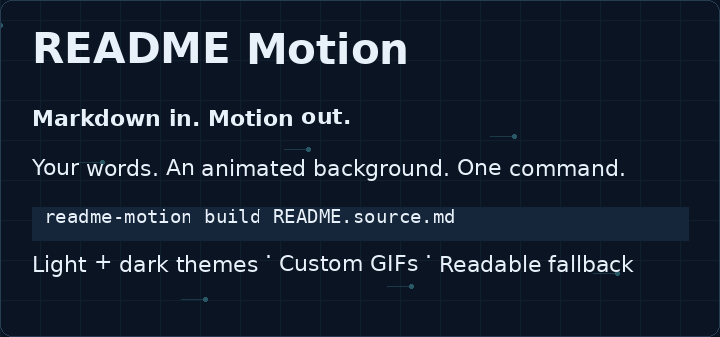
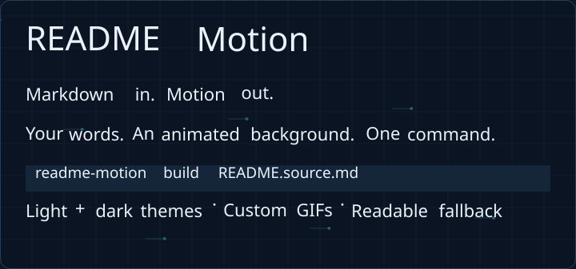

# GIF frames → animated SVG

The same README banner rendered three ways. Each animation below runs directly inside this GitHub README.

| Version | Size | Motion |
| --- | ---: | --- |
| Original GIF | 309 KB | 40 raster frames |
| Native SVG | 43 KB | Continuous vector animation |
| VTracer SVG | 1.57 MB | 12 sampled vector frames |

## Original GIF



## Native SVG



## Traced frames → animated SVG



The tracer uses [VTracer](https://github.com/visioncortex/vtracer), reuses identical paths, and switches frame visibility with CSS. This file contains vector paths, with no embedded GIF or JavaScript. Reduced-motion settings show its first frame.

Tracing approximates raster edges; small text can distort and the result can be larger than its source. Native Markdown → SVG preserves font shapes and produces much smaller files for this design. This example makes no claim of pixel-perfect conversion.

```sh
readme-motion trace animation.gif -o assets/animation.svg --max-frames 12
readme-motion trace frames/ -o assets/sequence.svg --fps 6
# Video input requires FFmpeg on PATH:
readme-motion trace clip.mp4 -o assets/clip.svg --duration 4
```

[Back to the full animated README](../README.md)
